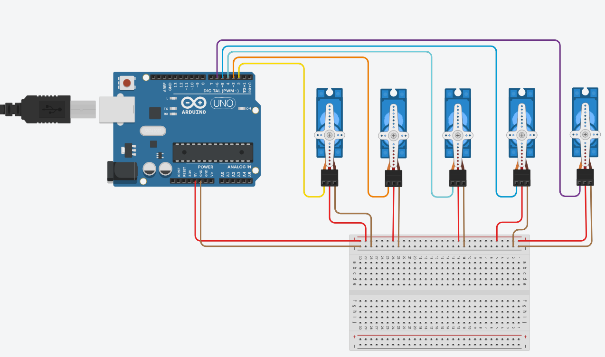

# bionic-hand - Mão Biônica com Arduino e Servo Motores

Projeto de uma mão biônica impressa em 3D, controlada por um Arduino através de cinco servo motores.  
Os movimentos (gestos) são acionados via comunicação serial/Bluetooth, permitindo controlar a mão remotamente por um aplicativo ou outro dispositivo.

## Visão Geral

Este projeto controla uma mão biônica de 5 dedos usando:

- **Arduino** (UNO, Nano ou compatível)
- **5 servo motores** (um para cada dedo)
- **Estrutura da mão** impressa em **impressora 3D**
- **Módulo Bluetooth (opcional)** para envio de comandos sem fio

A mão é capaz de realizar vários gestos pré-programados, como:

- Abrir e fechar a mão
- Gesto de vitória (✌)
- Gesto de rock 🤘
- Gesto do Homem-Aranha 🕷🕸
- Hang Loose 🤙
- Representação de números de 1 a 5 com os dedos

## Funcionalidades

- Controle individual dos 5 dedos por servo motores
- Gestos pré-definidos acionados por caracteres recebidos na serial/Bluetooth
- Inicialização com animação de abertura e fechamento da mão
- Feedback via monitor serial indicando o gesto atual

## Hardware Utilizado

- 1x Arduino (UNO, Nano, etc.)
- 5x Servo motores (SG90, MG90S ou similares)
- 1x Módulo Bluetooth (HC-05, HC-06 ou similar) – **opcional**, mas recomendado
- Fonte de alimentação adequada para os servos
- Estrutura da mão biônica impressa em 3D
- Jumpers e protoboard (se necessário)

### Ligações dos Servos

No código, os servos estão ligados às seguintes portas digitais:

- Servo do dedo 1 → **D2**
- Servo do dedo 2 → **D3**
- Servo do dedo 3 → **D4**
- Servo do dedo 4 → **D5**
- Servo do dedo 5 → **D6**

> **Importante:**  
> Não alimente todos os servos diretamente da porta 5V do Arduino se eles forem puxar muita corrente.  
> Use uma fonte externa 5V com GND comum ao Arduino.

### Conexão do Bluetooth (opcional)

Exemplo usando módulo HC-05:

- HC-05 TX → RX do Arduino  
- HC-05 RX → TX do Arduino (geralmente com divisor de tensão)  
- HC-05 VCC → 5V  
- HC-05 GND → GND  

> Você também pode usar a própria USB/Serial do Arduino para enviar os comandos pelo **Monitor Serial** da IDE.

## Software

### Dependências

- [IDE Arduino](https://www.arduino.cc/en/software)
- Biblioteca `Servo.h` (já vem incluída na IDE Arduino)

### Código Principal

O código faz:

- Configuração dos servos nas portas digitais
- Inicialização da comunicação serial a 9600 bps
- Animação inicial (abrir/fechar mão)
- Leitura contínua da serial
- Execução do gesto correspondente ao caractere recebido

## Mapeamento dos Comandos

### Os gestos são acionados por caracteres recebidos via serial/Bluetooth:

- 'a' → Abrir a mão

- 'f' → Fechar a mão

- 'v' → Gesto de Vitória (✌)

- 'r' → Gesto de Rock (🤘)

- 's' → Gesto do Aranha

- 'h' → Gesto Hang Loose (🤙)

- '1' → Gesto Número 1

- '2' → Gesto Número 2

- '3' → Gesto Número 3

- '4' → Gesto Número 4

- '5' → Gesto Número 5

Além disso, o caractere 't' dispara uma sequência de demonstração:

[Projeto no Tinkercard](https://www.tinkercad.com/things/dSHOwrBsTty-bionic-hand)